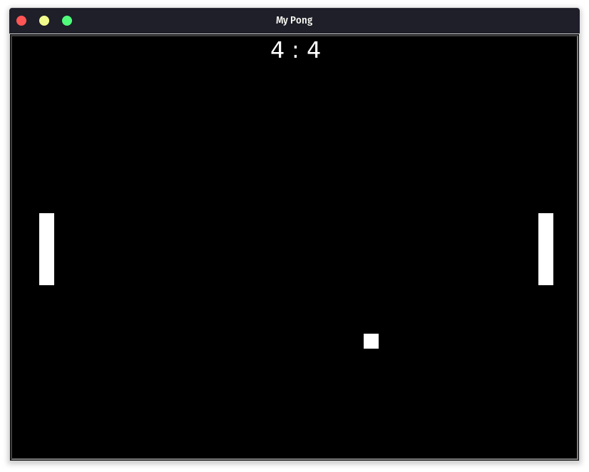

# Pong-Turtle

## Desenvolvedores

- [Angelo Marcio Souza Lopes Filho](https://github.com/angelo-filho)
- [Amós do Carmo Moreira Filho](https://github.com/AmosFilho)
- [Antônio Diego Furtado da Silva](https://github.com/TheLordDiego)
## O jogo

Esse jogo contém algumas melhorias e correção de bug do código presente na pasta pong do repositório do 
[Professor Jucimar Junior](https://github.com/jucimarjr/lpc_2021-2) e é uma forma de atividade para disciplina de Laboratório de Programação de Cmmputadores.
## Como rodar?

- No terminal, digite `python pong.py`

## Comandos:
- Jogador1: w e s.
- Jogador2: seta para cima e para baixo.

